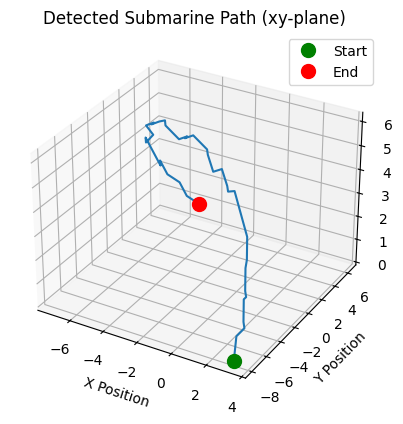
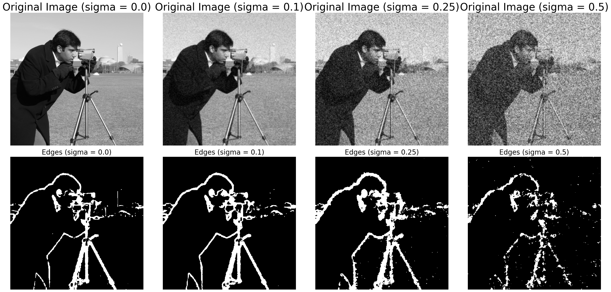
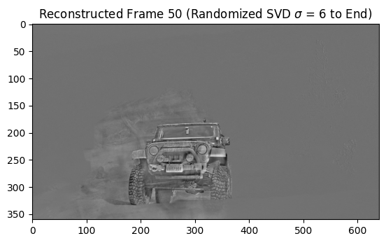
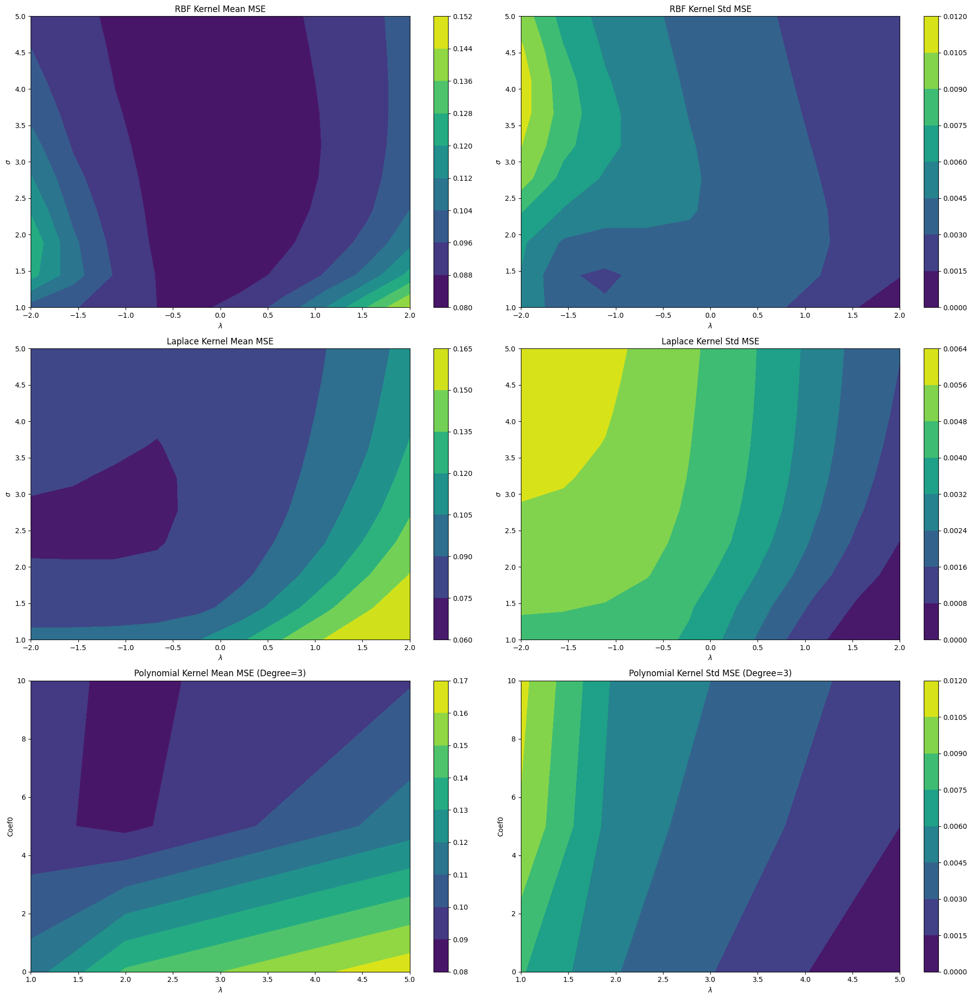
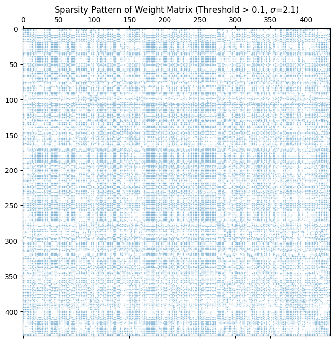
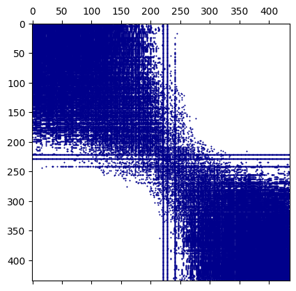

# Advanced Computational Methods for Data Analysis
**Selected Works from AMATH 582**

This portfolio highlights key projects focusing on dimensionality reduction, spectral analysis, and machine learning. Each project demonstrates the ability to translate complex, noisy, or high-dimensional data into actionable mathematical frameworks and robust algorithms.

---

### 1. Submarine Tracking via Spectral Filtering
**Core Objective:** Isolate and track a moving target's frequency signature from highly noisy 3D hydroacoustic sensor data.
* **Technical Approach:** Transformed 4D spatial-temporal tensor data into the frequency domain utilizing a 3D Fast Fourier Transform (FFT). This approach bypassed the naive O(N^2) computational bottleneck, improving efficiency to O(N log N).
* **Impact:** Designed and applied an adaptive Gaussian filter centered on the target's peak frequency, successfully decoupling the submarine's mechanical signature from heavy Gaussian white noise to reconstruct its precise 3D flight path.

---

### 2. Multi-Resolution Edge Detection in Degraded Images
**Core Objective:** Perform robust edge detection on digital images heavily degraded by varying levels of noise without losing structural boundaries.
* **Technical Approach:** Engineered a Multi-Resolution Analysis (MRA) pipeline utilizing Discrete Wavelet Transforms (DWT). Evaluated Haar, Daubechies (db2), and Coiflet (coif2) wavelet families across multiple decomposition scales.
* **Impact:** Aggregated wavelet magnitudes across levels to reinforce strong edges and average out random noise. The pipeline, optimized via adaptive Garrote thresholding and Gaussian blurring, significantly outperformed standard single-level analysis even under extreme noise conditions.

---

### 3. High-Dimensional Video Background Subtraction
**Core Objective:** Perform real-time background subtraction on video data where deterministic Singular Value Decomposition (SVD) is computationally prohibitive.
* **Technical Approach:** Implemented Randomized SVD (rSVD) using Gaussian random sampling to create a "sketch" of the input matrix's range before computing a low-rank approximation.
* **Impact:** Reduced algorithmic complexity from O(mn^2) to O(mn log k), achieving a 120x computational speedup on test datasets. Visual analysis proved the randomized method maintained near-identical accuracy for separating the static background (low-rank structure) from moving foreground elements (sparse outliers).

---

### 4. Physicochemical Wine Quality Classification
**Core Objective:** Classify wine quality using 11 chemical features while navigating class imbalances and complex, non-linear feature relationships.
* **Technical Approach:** Developed a supervised learning framework evaluating an Affine (Linear) Regressor against Kernel Ridge Regression models utilizing Radial Basis Function (RBF), Laplacian, and Polynomial kernels. Tuned hyperparameters via k-fold cross-validation.
* **Impact:** Demonstrated that the L1-norm Laplacian Kernel model handled quality-grading outliers best, achieving the peak classification accuracy of 64.7%. Leveraged the linear Affine model as a baseline to extract highly interpretable correlation coefficients, mapping the exact impact of features like alcohol content and acidity on specific quality tiers.

---

### 5. Spectral Clustering of Political Networks
**Core Objective:** Predict the partisan affiliation of 435 U.S. House members based on categorical voting records—a topological space where standard K-Means clustering fails.
* **Technical Approach:** Modeled the dataset as an interconnected network, utilizing a Gaussian distance metric to construct a Graph Laplacian. Computed the Fiedler vector to identify the structural bottleneck representing the partisan divide.
* **Impact:** Extended the unsupervised spectral clustering into a Semi-Supervised Learning (SSL) framework via Laplacian embedding. The algorithm successfully mapped non-linear voting behaviors to predict the entire congressional divide with 88% accuracy using only a small seed of labeled data.